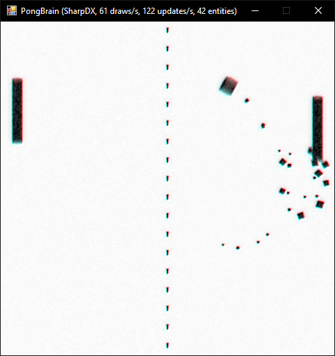

# PongBrain

An attempt at implementing an artificial neural network that plays pong. The game engine uses the entity-component architecture, so if all goes well, I might expand the scenario to include more complex game mechanics at a later time.

