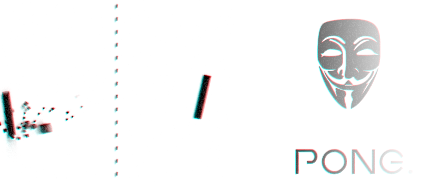

# Pong.

**Pong.** was a weekend project that started with the idea of creating a machine learning algorithm for the game Pong. Although an AI was implemented, **focus was shifted to the artistical aspects of the game.** All of the code—including engine, physics, HLSL shaders, etc—is written by me. No external libraries are used, except for [SharpDX](http://sharpdx.org/) which is merely used as a wrapper for DirectX and XAudio2.

### Features

<strong>Architecture<strong>  
. Carefully designed ECS (Entity–Component–System) engine  
. Separated into base engine and game implementation (for future use!)

<strong>Artificial Intelligence</strong>  
. So far just a trivial AI, although challenging enough.

<strong>Graphics</strong>  
. Camera effects (shaking)  
. Chromatic aberration  
. Hardware-accelerated graphics (DirectX 11.0)  
. Motion blur  
. Noise (ISO) shader  
. Object animations  
. Particle effects

<strong>Physics</strong>  
. Binary search for precise time-of-collision resolution  
. Collision detection (Separating Axis Theorem)  
. Realistic physics with fourth-order Runge–Kutta integration  
. Rigid body dynamics with convex polytopes

<strong>Sound</strong>  
. Background music  
. Multi-channel sound effects
