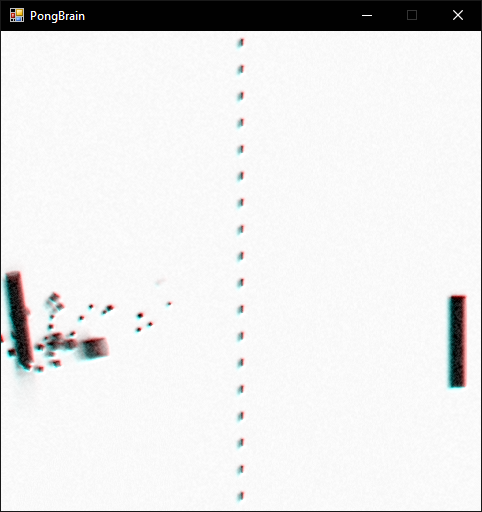

# PongBrain

An attempt at implementing an artificial neural network that plays pong. The game engine uses the entity-component architecture, so if all goes well, I might expand the scenario to include more complex game mechanics at a later time.

## Features (so far)

### Architecture
* Carefully designed ECS (Entity–Component–System) engine
* Separated into base engine and game implementation (for future use!)

### Artificial Intelligence
* So far just a trivial AI

### Graphics
* Camera effects (shaking)
* Chromatic aberration
* Hardware-accelerated graphics (DirectX 11.0)
* Motion blur
* Noise (ISO) shader
* Object animations
* Particle effects

### Physics
* Collision detection (Separating Axis Theorem)
* Realistic physics with fourth-order Runge–Kutta integration
* Rigid body dynamics with convex polytopes

## Sound
* Background music
* Multi-channel sound effects

